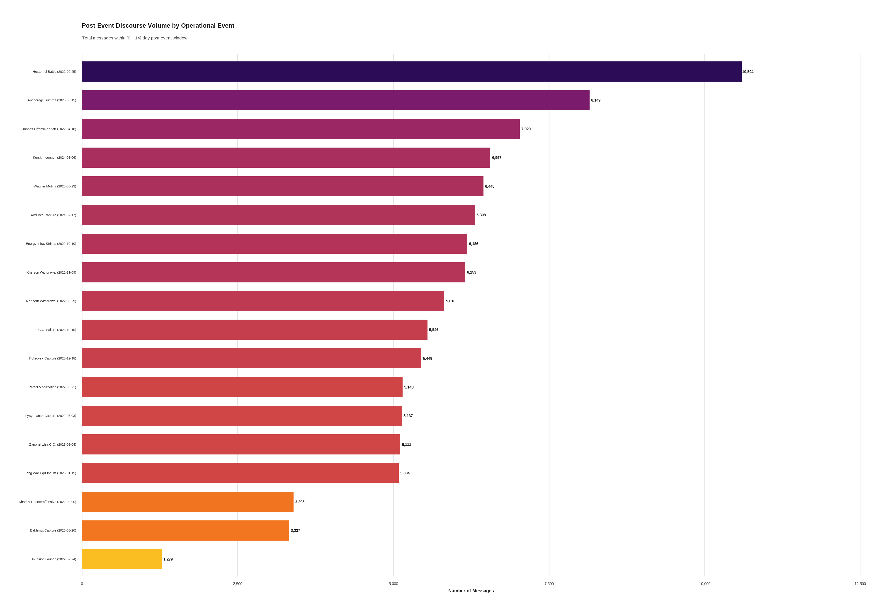
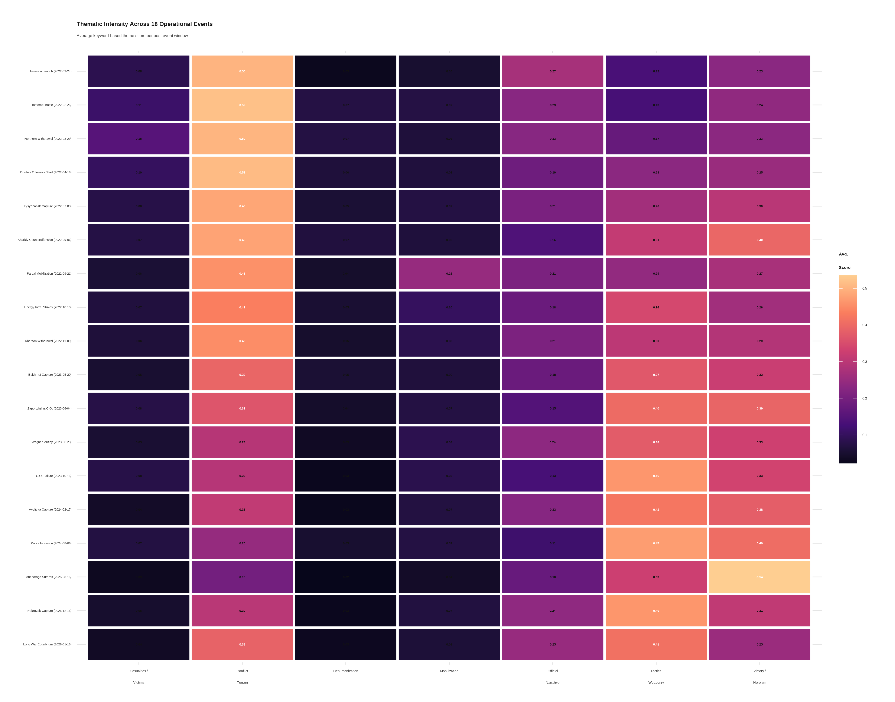
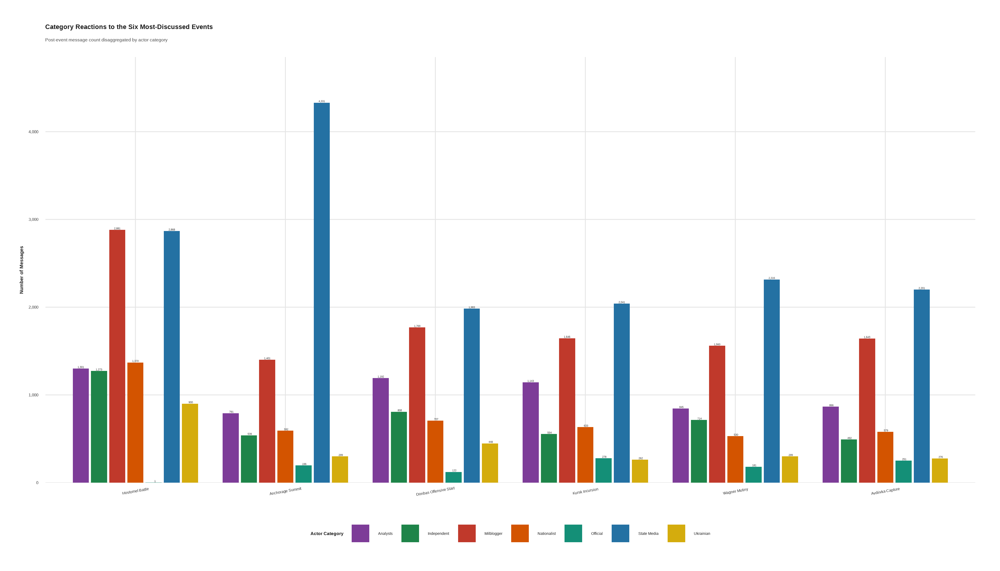
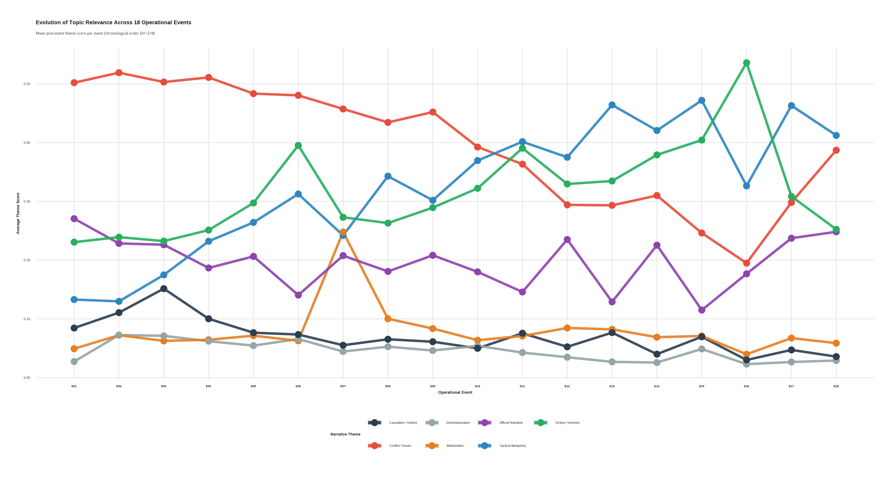

# Ukraine War Discourse Analysis

Quantitative analysis of pro-Russian Telegram propaganda across 18 major conflict events, 2022 to 2026.


---

## Research Question

> How do pro-Russian Telegram channels construct and adapt propaganda narratives in response to major military and political events during the Russia–Ukraine war?

## Overview

This project implements a full **research data pipeline**, from raw Telegram message scraping to quantitative discourse analysis, as part of a Bachelor's thesis in Digital Economics & Business at Università Politecnica delle Marche (UNIVPM).

### Key Findings

- Analyzed **18 major conflict events** spanning Feb 2022 – Jan 2026
- Identified **7 thematic categories** of propaganda discourse
- Tracked narrative evolution across events using theme-event matrices
- Quantified engagement patterns (views, reactions, forwards) by propaganda type

## Methodology

```
Telegram Channels → Scraper Pipeline → Annotated Dataset → Statistical Analysis → Visualizations
     (raw)            (Python)           (CSV)              (Python + R)          (ggplot2)
```

1. **Data Collection**: Custom Telegram scraper using Telethon API, targeting pro-Russian channels during defined event windows
2. **Annotation**: Automated thematic classification pipeline with manual validation
3. **Analysis**: Cross-tabulation, theme-event heatmaps, engagement metrics, temporal evolution
4. **Visualization**: Publication-quality charts in R (ggplot2) and Python (matplotlib/seaborn)

## Sample Results

| | |
|:---:|:---:|
|  |  |
| *Fig 1: Message volume across 18 events* | *Fig 2: Theme–event intensity heatmap* |
|  |  |
| *Fig 3: Engagement by propaganda category* | *Fig 5: Narrative evolution over time* |

## Project Structure

```
├── figures/                   # Thesis visualizations
├── data/                      # Data documentation
└── LICENSE
```

## Code Availability

The full pipeline and analysis code (Telegram scraper, thematic annotation, statistics and figure generation) lives in a separate private repository while the work is prepared for wider release. Access is available on request: mihretabworku8888@gmail.com

## Events Analyzed

| Code | Event | Date |
|------|-------|------|
| E01 | Invasion Launch | 2022-02-24 |
| E02 | Hostomel Battle | 2022-02-25 |
| E03 | Northern Withdrawal | 2022-03-29 |
| E04 | Donbas Offensive Start | 2022-04-18 |
| E05 | Lysychansk Capture | 2022-07-03 |
| E06 | Kharkiv Counteroffensive | 2022-09-06 |
| E07 | Partial Mobilization | 2022-09-21 |
| E08 | Energy Infrastructure Strikes | 2022-10-10 |
| E09 | Kherson Withdrawal | 2022-11-09 |
| E10 | Bakhmut Capture | 2023-05-20 |
| E11 | Zaporizhzhia Counteroffensive | 2023-06-04 |
| E12 | Wagner Mutiny | 2023-06-23 |
| E13 | Counteroffensive Failure | 2023-10-15 |
| E14 | Avdiivka Capture | 2024-02-17 |
| E15 | Kursk Incursion | 2024-08-06 |
| E16 | Anchorage Summit | 2025-08-15 |
| E17 | Pokrovsk Capture | 2025-12-15 |
| E18 | Long War Equilibrium | 2026-01-15 |

## Thematic Categories

| Theme | Description |
|-------|-------------|
| `conflict_terrain` | Military operations and territorial control |
| `tactical_weaponry` | Weapon systems and tactical developments |
| `official_narrative` | State justifications and information framing |
| `mobilization` | Recruitment, mobilization, and social cohesion |
| `victory_heroism` | Glorification and patriotic messaging |
| `dehumanization` | Enemy dehumanization and othering rhetoric |
| `casualties_victims` | Civilian suffering and humanitarian concerns |

## Citation

If you use this work in your research, please cite:

```bibtex
@thesis{morka2026telegram,
  author = {Morka, Mihretab Worku},
  title  = {Telegram as a Battlefield: Computational Analysis of Russian War Discourse Across 18 Operational Events (2022-2026)},
  school = {Università Politecnica delle Marche},
  year   = {2026},
  type   = {Bachelor's thesis},
  note   = {Supervisor: Prof. Giacomo di Tollo}
}
```

## License

This project is licensed under the MIT License, see the [LICENSE](LICENSE) file for details.

## Author

**Mihretab Worku Morka**
- BSc Digital Economics and Business, UNIVPM
- GitHub: [@mihretabworku](https://github.com/mihretabworku)

Thesis title: *Telegram as a Battlefield: Computational Analysis of Russian War Discourse Across 18 Operational Events (2022-2026)*
Supervisor: Prof. Giacomo di Tollo

The initial version of the Telegram data collection script was shared by Julien Godfroid (UCLouvain / Université Paris Nanterre); the pipeline in this repository was developed from it.
